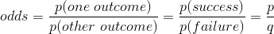
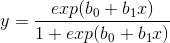
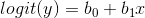

# Logistic Regression
(some of this was borrowed from an online source, but I no longer remember what it was :flushed:)
## Odds, Odds Ratios, and Logit
When you go to Pinnacles National Park, how do you know if you'll see a California condor (*Gymnogyps californianus*)? You looked on a birding website and it givs the odds of seeing a condor in July from Pinnacles Campground. The odds are 1 to 8, which are the odds of seeing North America's largest bird. This means in nine visits to Pinnacles in July, you would expect to see a condor 1 time and not see one the other 8. In probability terms, the _probability_ of seeing a condor is 1/9, or 0.111. But the _odds_ of seeing a condor are 1/8, or 0.125. Odds are actually the ratio of two probabilities... 



<!-- (\frac{p (one\ outcome)}{p(other\ outcome)}=\frac{p (success)}{p (failure)}=\frac{p}{q}) -->

where *q = 1 - p*

So for our Pinnacles condor, odds(seeing) = (1/9)/(8/9) = 1/8. Notice that odds have these properties:

* If p(success) = p(failure), then odds(success) = 1 (or 1 to 1, or 1:1).
* If p(success) < p(failure), then odds(success) < 1.
* If p(success) > p(failure), then odds(success) > 1.
* Unlike probability, which cannot exceed 1, there is no upper bound on odds.

The natural log (i.e., ln or log<sub>e</sub>) of odds is called the logit, or logit transformation, of p: logit(p) = log<sub>e</sub>(p/q). Logit is sometimes called "log odds." Because of the properties of odds given in the list above, the logit has these properties:

* If odds(success) = 1, then logit(p) = 0.
* If odds(success) < 1, then logit(p) < 0.
* If odds(success) > 1, then logit(p) > 0.
* The logit transform fails if p = 0.

Logistic regression is a method for fitting a regression curve, y = f(x), when y consists of proportions or probabilities, or binary coded (0,1--failure,success) data. When the response is a binary (dichotomous) variable, and x is numerical, logistic regression fits a logistic curve to the relationship between x and y. The logistic curve looks like an S-shaped or sigmoid curve, often used to model population growth, survival from a disease, the spread of a disease (or something disease-like, such as a rumor), and so on. The logistic function is... 



[//]: # (y='\frac{exp(b_{0} + b_{1}x)}{1 + exp(b_{0} + b_{1}x)}')

Logistic regression fits b<sub>0</sub> and b<sub>1</sub>, the regression coefficients (which were 0 and 1, respectively, for the graph above). It should have already struck you that this curve is not linear. However, the point of the logit transform is to make it linear... 



[//]: # (y=logit(y)=b_{0} + b_{1}x)

Hence, logistic regression is linear regression on the logit transform of y, where y is the proportion (or probability) of success at each value of x. However, you should avoid the temptation to do a traditional least-squares regression at this point, as neither the normality nor the homoscedasticity (variance of points around regression line is uniform) assumption will be met.

Odds ratio might best be illustrated by returning to searching for condors at Pinnacles. Your birding website gives the odds of seeing a peregrine falcon (*Falco peregrinus*) of 1 to 2. This means that you are expected to see a peregrine falcon once in every three July visits to the park. The odds of seeing a peregrine falcon are 1/2, or 0.5. How much better is this than odds for seeing a California condor? The odds ratio tells us: 0.5 / 0.125 = 4.0. The odds of seeing a peregrine falcon are four times the odds of seeing a condor. Be careful not to say "times as likely to see," which would not be correct. The probability (likelihood, chance) of seeing a peregrine falcon is 1/3 and for a California condor is 1/9, resulting in a likelihood ratio of 3.0. You areonly three times more likely to see a peregrine falcon than a California condor.


## Logistic Regression: One Numerical Predictor

**Now to Paleobiology**. Logistic regression acts on a binary response variable . A binary variable is one that that has only two outcomes. In our example here we will use extinction during the Maastrichtian stage as our predictor. This is binary repsonse because for all genera alive at some time during the Maastrichtian, they all either went extinct or they survived--there are only two possible outcomes. 

so here we want to use the logic of how *lad_age* is situated realtive to the time interval of interest to construct a new binary response variable called ``extinct``. Will set the value for extinct equal to 1 for genera that go extinct and equal to 0 for those genra that survive.

Load the paleosize data file that is in ``paleosizePaper/rawDataFiles`` directory and we'll perform a logistic regression of how well body size predicts going extinct at the end of the Cretaceous period. 

1) Read in data.

````r
# read in size and timescale data files
sizeData <- read.delim('bodySizes.txt') 
timescale <- read.delim('timescale.txt') 
````

2) Extract all genera alive during the *_Maastrichtian_*, the last stage of the Cretaceous Period.

````r
# subset data frame to get only genera alive at some time during the Maastrichtian
maasTime <- timescale[timescale$interval_name == 'Maastrichtian',]
maas <- subset(sizeData, fad_age > maasTime$age_top & lad_age < maasTime$age_bottom) # note the introduction of a new functino, subset()
````

Note that you can put as many arguments within the subset function to get the desired subset of data. In the situation here we used two arguements related to the extinction time. **Make sure you understand how these two arguements limit the occurrences to those that were alive sometime during the Maastrichtian.** It may help to draw a picture.

3) Add a new binary column for the Maastrichtian subset were genera tha survived the extincton have a value of ``0`` and genera that went extinct get a value of ``1``.

````r
# create a column that indicates taht a genus has gone extinct (1) or not (0)
maas$extinct <- 0 # this makes a new column called extinct and gives every element a value of 0
maas$extinct[maas$lad_age < maasTime$age_bottom & maas$lad_age >= maasTime$age_top] <- 1 # set thouse genera whose lad is within the Maastrichtian. Note the use of >=, which is "greater than or equal to".
````
**Once again, make sure you understand how these two arguements limit the occurrences to those that were went extinct during the Maastrichtian.**

4) Just to make things easier, let's make a new variable for log transformed size

````r
maas$logVolume <- log10(maas$max_vol)
````

5) Now thave you have a response variable, let's make a plot of extinction vs size in Maastrichtian aminals.

````r
plot(maas$logVolume, maas$extinct, xlab="log biovolume (cubic mm)", ylab="Extinction status", pch=16, col=rgb(0.2,0.2,0.2,0.4), cex=1.5)
````

6) Now let's perform the logistic regression.  This first step is to define our formula.  We could do this within the regression function itself, but it will make any editing easier if we make the formula as a separate variable.  Note that the formula is text wrapped in quotes.  In English, the formula is read "y is predicted by x" or in our case "extinction mode is predicted by size".

````r
glmEqn <-"extinct ~ logVolume" # these correspond to column names in maas.
````

We use the ``glm()`` [generalized linear model] function to perform the regression. To indicate that we're doing a logistic regression, we specify the family parameter as below.

````r
maasGlm <- glm(glmEqn, family="binomial", data=maas) # this runs the regression

summary(maasGlm) # view a summary of the results
````

The Summary function provides a summary of the regression output. The main part of the summary to pay attention to is the table called 'Coefficients'. You can view the coefficients on their own by calling" ``summary(maasGlm)$coefficients``. The first row in this table coresonds to the intercept of the logistic resion equation The intercept is analagous to the intercept of the standard linear regression equation, but doesn't have much practical interpretation so we'll ignore it. Instead we'll focus on the second row, which is the coefficient for body size (analagous to the slope in a standard linear equation). The coefficient is actually the log-odds associated with size. The log-odds for size in our example is 0.14. This means that for ...

7) Now let's add the logistic regression to your plot.

````r
points(maas$logVolume, maasGlm$fitted, col="red", pch=16)
````

Recall that the response variable is log odds, so the coefficient of "logL" can be interpreted as "for every one mm increase in size the odds of being a parasite increase by exp(9.4706) = 12,972 times”!!!!
sLogistic Regression: Categorical Predictors

Let's now add the life modes to our analysis to simultaneously consider the affects of size and life mode on the odds of extinction.  There are only 4 brachiopod life modes in the late Devonian (541, 261, 561, 361), so we can make binary variables for each.

# first remove genera without a life mode
brachs <- brachs[!is.na(brachs$ecospace),]

# make new column for binary life modes
brachs$lm541 <- 0
brachs$lm541[brachs$ecospace == 541] <- 1

brachs$lm261 <- 0
brachs$lm261[brachs$ecospace == 261] <- 1

brachs$lm561 <- 0
brachs$lm561[brachs$ecospace == 561] <- 1

brachs$lm361 <- 0
brachs$lm361[brachs$ecospace == 361] <- 1

head(brachs)

Once again, we want to specify a regression equation, then run the regression.  Note that we can't easily plot these data because we would now need an plot with 6 axes.

glm.eqn <-"extinct ~ size + lm541 + lm261 + lm561 + lm361"

ext.glm <- glm(glm.eqn, family=binomial(logit), data=brachs)

Let's see what we have found... 

summary(ext.glm)

This shows that only significant predictor of extinction is having a life mode of 561 (Pr(>|z|) >= 0.05). All else being equal, the odds of a 561 going extinct was 13.3 (exp(2.58884)) times greater than surviving the extinction.